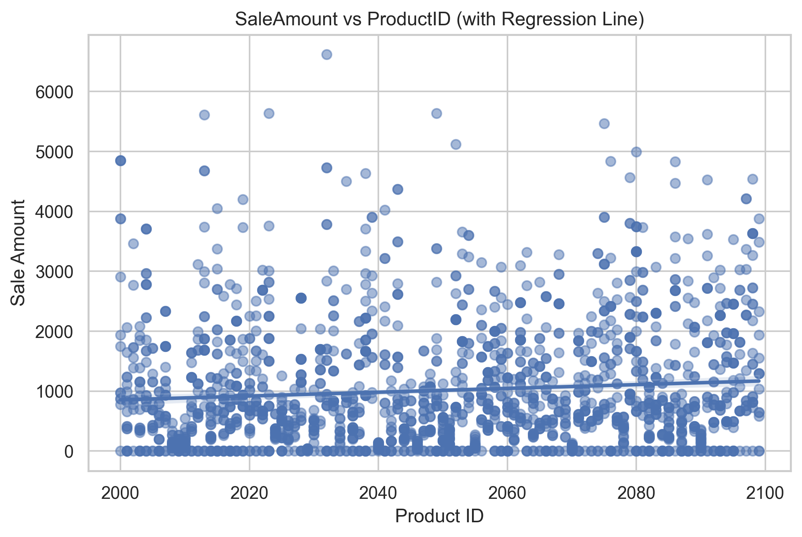
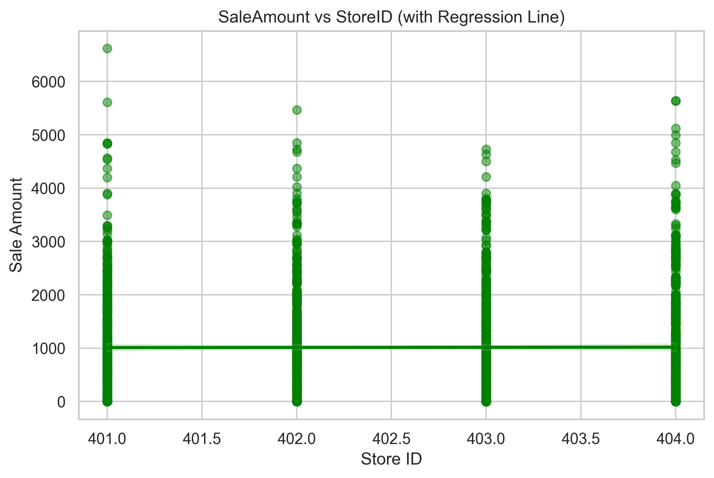
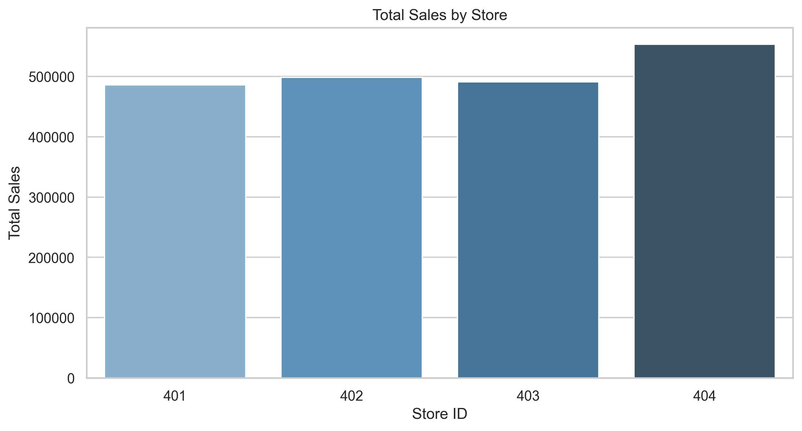

# Notebooks

[](https://justicetefera.github.io/datafun-04-notebooks/workflow-b-apply-example-project/)
[](./pyproject.toml)
[](./LICENSE)

> Professional Python project: exploratory data analysis with Jupyter notebooks.

# Sales Data Exploratory Analysis

This project performs a complete exploratory data analysis (EDA) on a retail sales dataset.
It includes data cleaning, aggregation, visualization, insights, and business recommendations.

## Key Features
- Data cleaning with type correction and invalid value handling
- Aggregations (store-level, product-level, monthly sales)
- Visualizations saved to `notebooks/docs/visuals`
- Correlation heatmap
- Regression-based scatterplots
- Insights and business recommendations
- Full logging to `project.log` for traceability

## Project Structure


## This Project

This project provides a complete **Exploratory Data Analysis (EDA)** workflow for a retail sales dataset.
It demonstrates how to understand a new dataset quickly and professionally by combining narrative explanation, Python code, and visual analytics inside a Jupyter notebook.

The analysis includes structured data validation, descriptive statistics, grouped summaries, and multiple visualizations that reveal patterns in store performance, product behavior, and transaction values.
All generated figures are saved to `notebooks/docs/visuals`, and every major step is recorded in `project.log` to ensure transparency and reproducibility.

The project also delivers clear insights and business recommendations based on observed trends, making it useful not only as a technical example but also as a practical decision‑support tool.
Overall, it serves as a model for how to explore, document, and communicate findings from tabular data in a professional analytics environment.


## Working Files


- **docs/** - the project narrative and documentation
- **src/datafun** - supporting Python module
- **notebooks/** - where the analysis happens
- **pyproject.toml** - update authorship & links
- **zensical.toml** - update authorship & links

## Instructions (Jupyter Notebook)


## Success


========================
Executed successfully!
========================
```


### In a VS Code terminal

These are listed for convenience.
For best results, follow the detailed instructions in
[pro-analytics-02 guide] (https://justicetefera.github.io/datafun-04-notebooks/)
to complete:

```shell
uv self update
uv python pin 3.14
uv sync --extra dev --extra docs --upgrade

```

</details>


### 🔥 Correlation Heatmap


Shows the strength and direction of relationships between numerical variables.

### 📈 Distribution of Sale Amount


Displays how sale amounts are spread across the dataset.

### 🛒 Sale Amount vs Product ID


Reveals how different products contribute to overall sales.

### 🏬 Sale Amount vs Store ID


Compares sales performance across stores.

### 💵 Total Sales by Store


Summarizes total revenue per store.
