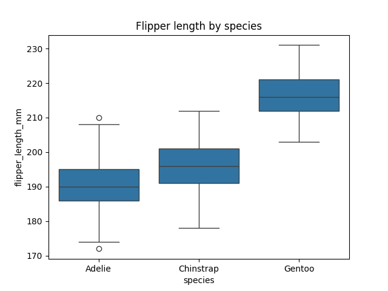

# Notebooks

[](https://justicetefera.github.io/datafun-04-notebooks/workflow-b-apply-example-project/)
[](./pyproject.toml)
[](./LICENSE)

> Professional Python project: exploratory data analysis with Jupyter notebooks.

# Sales Data Exploratory Analysis

This project performs a complete exploratory data analysis (EDA) on a retail sales dataset.
It includes data cleaning, aggregation, visualization, insights, and business recommendations.

## Key Features
- Data cleaning with type correction and invalid value handling
- Aggregations (store-level, product-level, monthly sales)
- Visualizations saved to `docs/images/`
- Correlation heatmap
- Regression-based scatterplots
- Insights and business recommendations
- Full logging to `project.log` for traceability

## Project Structure
project/
│
├── data/
│   └── sales_data.csv
│
├── docs/
│   └── images/
│       ├── correlation_heatmap.png
│       ├── total_sales_by_store.png
│       ├── distribution_saleamount.png
│       ├── saleamount_vs_productid.png
│       └── saleamount_vs_storeid.png
│
├── notebooks/
│   └── sales_analysis.ipynb
│
├── src/
│   └── datafun/
│       ├── __init__.py
│       ├── data_cleaning.py
│       ├── visualizations.py
│       └── analysis_utils.py
│
├── project.log
├── pyproject.toml
├── README.md
└── LICENSE


## This Project

This project provides a complete **Exploratory Data Analysis (EDA)** workflow for a retail sales dataset.
It demonstrates how to understand a new dataset quickly and professionally by combining narrative explanation, Python code, and visual analytics inside a Jupyter notebook.

The analysis includes structured data validation, descriptive statistics, grouped summaries, and multiple visualizations that reveal patterns in store performance, product behavior, and transaction values.
All generated figures are saved to `docs/images/`, and every major step is recorded in `project.log` to ensure transparency and reproducibility.

The project also delivers clear insights and business recommendations based on observed trends, making it useful not only as a technical example but also as a practical decision‑support tool.
Overall, it serves as a model for how to explore, document, and communicate findings from tabular data in a professional analytics environment.


## Working Files

You'll work with just these areas:

- **docs/** - the project narrative and documentation
- **src/datafun** - supporting Python module
- **notebooks/** - where the analysis happens
- **pyproject.toml** - update authorship & links
- **zensical.toml** - update authorship & links

## Instructions (Jupyter Notebook)

Follow the
[step-by-step workflow guide][step-by-step workflow guide](https://justicetefera.github.io/datafun-04-notebooks/)
to complete:

1. Phase 1. **Start & Run**
2. Phase 2. **Change Authorship**
3. Phase 3. **Read & Understand**
4. Phase 4. **Modify**
5. Phase 5. **Apply**


## Success

After completing Phase 1. **Start & Run**, you'll have your own GitHub project,
with the example notebook executed and committed,
and running the example script will print out:

```shell
========================
Executed successfully!
========================
```

A new file `project.log` will appear in the root project folder.

## Command Reference

The commands below are used in the workflow guide above.
They are provided here for convenience.

Follow the guide for the **full instructions**.

<details>
<summary>Show command reference</summary>

### In a machine terminal (open in your `Repos` folder)

After you get a copy of this repo in your own GitHub account,
open a machine terminal in your `Repos` folder:

```shell
# Replace username with YOUR GitHub username.
git clone https://github.com/justicetefera/datafun-04-notebooks

cd datafun-04-notebooks
code .
```

### In a VS Code terminal

These are listed for convenience.
For best results, follow the detailed instructions in
[pro-analytics-02 guide] (https://justicetefera.github.io/datafun-04-notebooks/)
to complete:

```shell
uv self update
uv python pin 3.14
uv sync --extra dev --extra docs --upgrade

uvx pre-commit install

git add -A
uvx pre-commit run --all-files
# repeat if changes were made
uvx pre-commit run --all-files

# run the module to verify the environment (.venv)
uv run python -m datafun.app_case

# do chores
uv run ruff format .
uv run ruff check . --fix
uv run python -m pyright
uv run python -m pytest
uv run python -m zensical build

# save progress
git add -A
git commit -m "update"
git push -u origin main
```

</details>

## Notes

- Use the **UP ARROW** and **DOWN ARROW** in the terminal to scroll through past commands.
- Use `CTRL+f` to find (and replace) text within a file.
- You do not need to add to or modify `tests/`. They are provided for example only.
- Many files are silent helpers. Explore as you like, but nothing is required.
- You do NOT not to understand everything; understanding builds naturally over time.

## Example Output

2026-05-31 08:13:42,024 INFO ***** Notebook Execution Started Successfully *****
2026-05-31 08:13:42,149 INFO Notebook execution started.
2026-05-31 08:13:42,152 INFO Imported pandas, seaborn, matplotlib, and set visualization theme.
2026-05-31 08:13:42,183 INFO Notebook execution started.
2026-05-31 08:13:42,185 INFO Imported pandas, seaborn, matplotlib, and set visualization theme.
2026-05-31 08:13:42,226 INFO Loaded dataset from ../data/raw/sales_data.csv
2026-05-31 08:13:42,265 INFO Inspected DataFrame structure: shape, columns, dtypes, missing values, info, and preview.
2026-05-31 08:13:42,313 INFO Cleaned dataset: converted SaleAmount to numeric, fixed CampaignID blanks, standardized CampaignID type, and converted SaleDate to datetime.
2026-05-31 08:13:42,381 INFO Computed total sales by store using groupby and sorted results.
2026-05-31 08:13:42,414 INFO Computed average sale amount by product using groupby and sorted results.
2026-05-31 08:13:42,453 INFO Computed total sales by month: extracted SaleMonth period and aggregated SaleAmount.
2026-05-31 08:13:42,530 INFO Computed numeric-only correlation matrix for the dataset.
2026-05-31 08:13:43,140 INFO Generated and saved correlation_heatmap.png
2026-05-31 08:13:43,314 INFO Using categorical units to plot a list of strings that are all parsable as floats or dates. If these strings should be plotted as numbers, cast to the appropriate data type before plotting.
2026-05-31 08:13:43,328 INFO Using categorical units to plot a list of strings that are all parsable as floats or dates. If these strings should be plotted as numbers, cast to the appropriate data type before plotting.
2026-05-31 08:13:43,585 INFO Generated and saved total_sales_by_store.png
2026-05-31 08:13:44,100 INFO Generated and saved distribution_saleamount.png
2026-05-31 08:13:44,810 INFO Generated and saved saleamount_vs_productid.png
2026-05-31 08:13:45,491 INFO Generated and saved saleamount_vs_storeid.png
2026-05-31 08:13:45,624 INFO Printed final insights and conclusions for the analysis.
2026-05-31 08:13:45,659 INFO Added final summary markdown section to the notebook.
2026-05-31 08:13:45,694 INFO Added business recommendations markdown section to the notebook.
2026-05-31 08:13:45,728 INFO ***** Notebook Executed Successfully *****

## Findings and Visuals

Take screenshots of your charts and provide them here with a discussion.
In Markdown, display a figure by using:
an exclamation mark immediately followed by square brackets containing a useful caption
immediately followed by parentheses containing the relative path to your figure.
Note: When you start typing the path with a dot (.) for "here, in this directory",
the IDE may help complete the path.

Follow this example, but the figures should
reflect your work and include your narrative.
Remove unnecessary instructional comments in your final version of this README.md.



