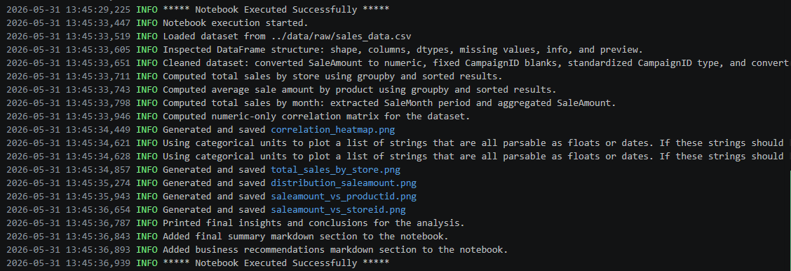

# Jupyter Notebooks

[](./pyproject.toml)
[](./LICENSE)

> Professional Python project: exploratory data analysis with Jupyter notebooks.
# Sales Data Exploratory Analysis

This project delivers a comprehensive Exploratory Data Analysis (EDA) of a multi‑store retail sales dataset. It integrates rigorous data preparation, structured statistical exploration, and a suite of visual analytics to uncover operational patterns, product performance behaviors, and revenue‑driving factors across the business.

# Key Features
- **Data cleaning** with type correction, missing‑value handling, and validation of inconsistent entries
- **Aggregations** with type correction, missing‑value handling, and validation of inconsistent entries
- **Visual analytics** stored in `notebooks/docs/images/`
- **Correlation heatmap** for relationship discovery
- **Regression‑based scatterplots** for trend identification
- **Insights and business recommendations** grounded in observed patterns
- Full logging to `project.log` for traceability

# Project Overview

This project provides a structured, end‑to‑end EDA workflow designed to help analysts, data scientists, and decision‑makers quickly understand the behavior of a retail dataset. It blends narrative explanation, modular Python code, and high‑quality visualizations to create a clear, professional analytical story.

# The workflow includes:

- **Data validation** to ensure analytical reliability
- **Descriptive statistics** to establish baseline understanding
- **Grouped summaries** to highlight store‑ and product‑level differences
- **Visual representations** that reveal trends not immediately visible in raw data
- **Interpretation and recommendations** that translate findings into actionable insights

Overall, this project serves as a model for how to explore, document, and communicate findings from tabular retail data in a polished analytics environment.


# 📦 Dataset Description

The analysis in this project is based on a structured retail sales dataset representing transactions from four distinct stores (StoreID 401–404). The dataset captures individual sales events, product information, customer identifiers, and optional marketing campaign references. It is designed to reflect the operational behavior of a small multi‑store retail network and provides meaningful exploration of revenue patterns, product performance, and store‑level behavior.


## Instructions (Jupyter Notebook)

<details>
<summary><strong>Click to Expand</strong></summary>

<br>

### 1. Activate the Project Environment
Update uv, pin Python, sync dependencies, then activate your virtual environment.

uv self update
uv python pin 3.14
uv sync --extra dev --extra docs --upgrade

### Windows PowerShell
.\.venv\Scripts\activate

### macOS / Linux
source .venv/bin/activate

### 2. Install required dependencies
Install all required Python packages.

```bash
pip install -r requirements.txt
```

### 3. Run the Sales Analysis Module
Execute the main analysis script to perform data cleaning, aggregation, and visualization.

```bash
python -m src.sales_analysis
```
### 4. Open the Jupyter Notebook
To explore the analysis interactively, open the primary notebook.

```bash
jupyter notebook notebooks/eda_sales_data.ipynb
```

### 5. Review Output Files
After running the analysis, you can find:

- Generated charts in notebooks/docs/images/
- Logs in `project.log`
- Cleaned or transformed data (if applicable) in data/processed/

</details>

## Project log output



# 📊 Visual Representations
Below is a refined and professionally expanded explanation of each visualization, written to align with industry‑standard analytical reporting and to clearly communicate the purpose and value of each chart included in the analysis.

🔥

Shows the strength and direction of relationships between numerical variables. This visualization helps identify which features move together, which ones oppose each other, and which variables have little to no relationship. It supports decisions about feature selection, model preparation, and deeper statistical analysis by highlighting meaningful patterns and potential multicollinearity.

📈

Displays how sale amounts are spread across the dataset. This chart reveals the overall shape of customer spending behavior, including skewness, concentration of low‑value transactions, and the presence of unusually high sales. Understanding this distribution helps analysts detect outliers, evaluate revenue patterns, and determine whether transformations or normalization may be needed.

🛒

Reveals how different products contribute to overall sales. This scatterplot highlights which products consistently generate higher revenue, which ones underperform, and whether certain product categories cluster around specific price or sale ranges. It supports inventory planning, pricing strategy, and product‑level performance evaluation.
