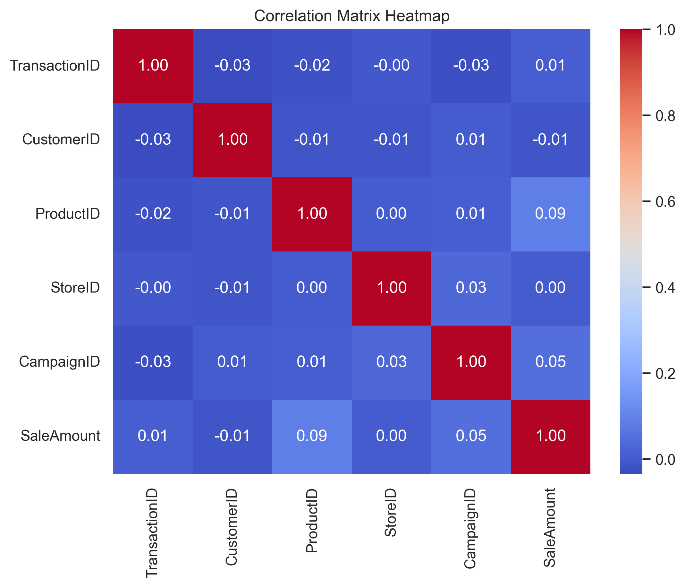
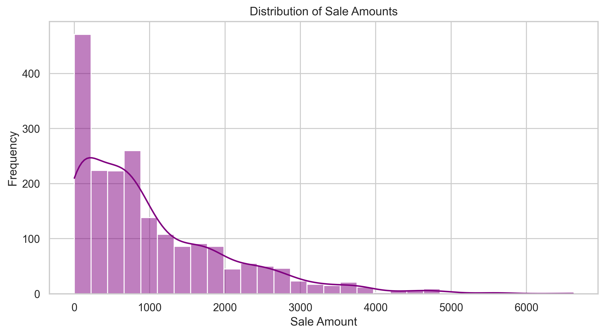
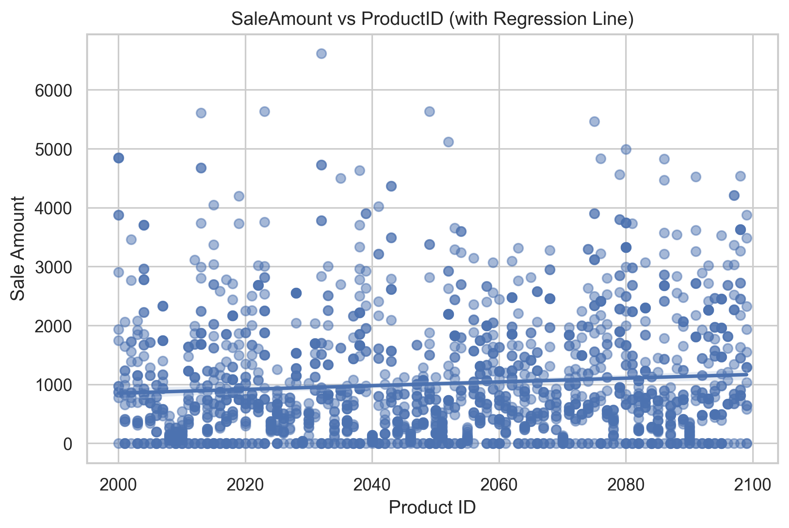

# Jupyter Notebooks

[]
[]

> Professional Python project: exploratory data analysis with Jupyter notebooks.
# Sales Data Exploratory Analysis

This project delivers a comprehensive Exploratory Data Analysis (EDA) of a multi‑store retail sales dataset. It integrates rigorous data preparation, structured statistical exploration, and a suite of visual analytics to uncover operational patterns, product performance behaviors, and revenue‑driving factors across the business.

# Key Features
- **Data cleaning** with type correction, missing‑value handling, and validation of inconsistent entries
- **Aggregations** with type correction, missing‑value handling, and validation of inconsistent entries
- **Visual analytics** stored in `notebooks/docs/images/`
- **Correlation heatmap** for relationship discovery
- **Regression‑based scatterplots** for trend identification
- **Insights and business recommendations** grounded in observed patterns
- Full logging to `project.log` for traceability

# Project Overview

This project provides a structured, end‑to‑end EDA workflow designed to help analysts, data scientists, and decision‑makers quickly understand the behavior of a retail dataset. It blends narrative explanation, modular Python code, and high‑quality visualizations to create a clear, professional analytical story.

# The workflow includes:

- **Data validation** to ensure analytical reliability
- **Descriptive statistics** to establish baseline understanding
- **Grouped summaries** to highlight store‑ and product‑level differences
- **Visual representations** that reveal trends not immediately visible in raw data
- **Interpretation and recommendations** that translate findings into actionable insights

Overall, this project serves as a model for how to explore, document, and communicate findings from tabular retail data in a polished analytics environment.

# 📦 Dataset Description

The analysis in this project is based on a structured retail sales dataset representing transactions from four distinct stores (StoreID 401–404). The dataset captures individual sales events, product information, customer identifiers, and optional marketing campaign references. It is designed to reflect the operational behavior of a small multi‑store retail network and provides meaningful exploration of revenue patterns, product performance, and store‑level behavior.

## Visualizations

Shows the strength and direction of relationships between numerical variables.

Displays how sale amounts are spread across the dataset.

Reveals how different products contribute to overall sales.....here is the top of the projec
